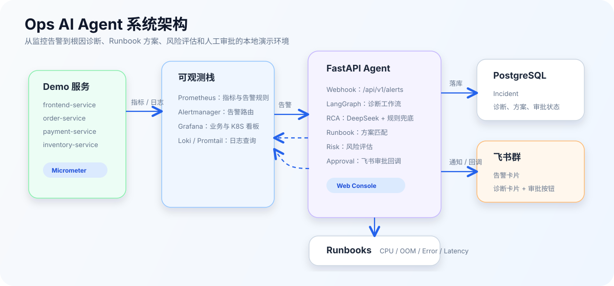
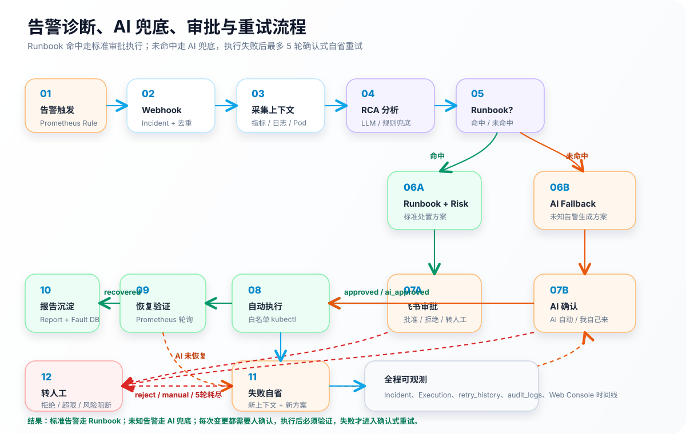

# Ops AI Agent

Ops AI Agent 是一个面向本地演示和学习的智能运维系统。它接收 Prometheus
Alertmanager 告警，自动采集指标、日志、Kubernetes 状态和服务信息，生成根因
诊断、匹配 Runbook、评估风险，并通过飞书卡片完成人工审批。

当前版本已覆盖 **Phase 3：审批后的自动执行、恢复验证和故障报告沉淀**。Agent
不会跳过审批直接改集群；只有审批通过后，才会执行白名单内的安全命令，并把执行
记录、验证结果和 Markdown 报告保存下来。

## 核心能力

- 告警接入：接收 Alertmanager Webhook，创建并去重 Incident。
- 上下文采集：查询 Prometheus、Loki、Kubernetes 和 Mock CMDB。
- 根因分析：优先调用 DeepSeek；不可用时使用规则兜底。
- 方案生成：根据告警匹配 CPU、OOM、错误率、延迟 Runbook。
- 风险评估：结合操作风险、告警级别、生产环境和核心服务加权。
- 人工审批：飞书卡片支持「批准执行」「拒绝」「转人工」。
- 自动执行：审批通过后执行白名单 kubectl 命令，并写入审计和执行记录。
- 恢复验证：执行后轮询 Prometheus 指标，未恢复则升级人工。
- 报告沉淀：生成 Markdown 故障报告，并沉淀历史故障特征。
- Web Console：查看 Incident、执行记录、故障报告和审批状态。

## 系统架构



## 告警诊断、审批与自动处置流程



## 深入文档

- [告警诊断与处置完整流程](docs/alert-diagnosis-flow.md)：说明服务告警如何被 Prometheus 感知、Alertmanager 如何调用 Agent、Agent 如何采集上下文、诊断、审批、执行、验证和生成报告。
- [测试用例文档](docs/test-cases.md)：覆盖本地启动、可观测栈、API、飞书审批、Phase 1/2/3 E2E、去重、执行安全和清理恢复。
- [飞书卡片回调配置指南](docs/feishu-card-callback.md)：说明飞书按钮回调、公网 HTTPS 地址和本地联调注意事项。

## 快速开始

### 1. 选择运行环境

推荐环境：

| 系统 | 是否推荐 | 说明 |
|------|----------|------|
| macOS | 推荐 | 直接使用 Homebrew 安装依赖后运行 `./ops.sh` |
| Linux | 推荐 | 使用系统包管理器安装依赖后运行 `./ops.sh` |
| Windows + WSL2 Ubuntu | 推荐 | 在 WSL2 内运行项目，Docker Desktop 开启 WSL 集成 |
| Windows 原生 CMD/PowerShell | 不支持 | `ops.sh` 依赖 Bash、类 Unix 进程管理和 `os.fork()` |

> Windows 用户请使用 WSL2，不建议把项目放在 `/mnt/c` 下运行。建议 clone 到
> WSL 的 Linux 文件系统中，例如 `~/projects/ops-ai-agent`。

### 2. 准备依赖

macOS：

```bash
brew install docker kind helm kubectl maven python
```

Ubuntu / WSL2：

```bash
sudo apt update
sudo apt install -y curl git python3 python3-venv maven
```

Ubuntu / WSL2 还需要安装 Docker、kind、kubectl、helm。推荐做法：

- 安装 Docker Desktop，并在设置中开启 WSL Integration。
- 在 WSL 中确认 `docker version` 可用。
- 按官方文档安装 `kind`、`kubectl`、`helm`。

启动前请确认 Docker Desktop 或本机 Docker 服务已经运行。

### 3. 初始化配置

```bash
cp .env.example .env
```

可选配置：

```bash
# LLM 根因分析
DEEPSEEK_API_KEY=sk-xxx

# 飞书卡片通知
FEISHU_APP_ID=cli_xxx
FEISHU_APP_SECRET=xxx
SERVICE_CHAT_IDS='{"order-service":"oc_xxx","payment-service":"oc_xxx"}'
```

未配置 DeepSeek 时会使用规则兜底；未配置飞书时，告警接收、诊断、数据库保存和
Web Console 仍然可用。

### 4. 一键启动

```bash
./ops.sh bootstrap
```

首次启动会创建 Python 虚拟环境、PostgreSQL、Redis、Kind 集群、Prometheus、
Alertmanager、Grafana、Loki、Promtail、四个 Demo 服务和 Agent。首次拉镜像和
构建 Java 服务会比较慢。

日常启动已有环境：

```bash
./ops.sh start
```

### 5. 检查状态

```bash
./ops.sh status
```

正常时应看到：

- Agent、Prometheus、Alertmanager、Loki、Grafana 均为 `正常`。
- Demo 服务 Deployment 均为 `2/2`。
- Prometheus targets 显示 `8/8 targets UP`。

## 常用入口

| 入口 | 地址 |
|------|------|
| Web Console | [http://localhost:8000](http://localhost:8000) |
| 执行记录 | [http://localhost:8000/executions.html](http://localhost:8000/executions.html) |
| 故障报告 | [http://localhost:8000/reports.html](http://localhost:8000/reports.html) |
| Agent API 文档 | [http://localhost:8000/docs](http://localhost:8000/docs) |
| Incident API | [http://localhost:8000/api/v1/incidents](http://localhost:8000/api/v1/incidents) |
| Grafana | [http://localhost:30030](http://localhost:30030) |
| Demo 业务看板 | [Demo Services Overview](http://localhost:30030/d/demo-services/demo-services-overview) |
| Prometheus Alerts | [http://localhost:9090/alerts](http://localhost:9090/alerts) |
| Alertmanager | [http://localhost:9093](http://localhost:9093) |

Grafana 本地默认账号：

```text
admin / admin123
```

## 常用命令

| 命令 | 说明 |
|------|------|
| `./ops.sh bootstrap` | 首次初始化并启动完整环境 |
| `./ops.sh start` | 启动已有环境 |
| `./ops.sh restart` | 重启 Agent、proxy 和端口转发 |
| `./ops.sh stop` | 停止后台进程和 Docker Compose，保留数据 |
| `./ops.sh status` | 查看健康状态和配置提示 |
| `./ops.sh logs agent` | 查看 Agent 日志 |
| `./ops.sh demo restart` | 重新构建并部署 Demo 服务 |
| `./ops.sh test` | 运行 CPU 故障注入 + AI 兜底诊断端到端演示 |
| `./ops.sh test ai` | 只运行 AI 兜底诊断端到端演示 |
| `./ops.sh test cpu` | 只运行 CPU 故障注入端到端演示 |
| `tests/e2e_phase2.sh` | 验证 Runbook、风险评估和审批状态 |
| `tests/e2e_phase3.sh` | 验证审批后自动执行、恢复验证和报告生成 |
| `./ops.sh clean` | 停止服务并删除 Kind 集群 |
| `./ops.sh clean --all` | 同时删除 PostgreSQL 和 Redis 数据卷 |

## 运行演示

基础演示：

```bash
./ops.sh status
./ops.sh test
```

只验证 AI 兜底诊断：

```bash
./ops.sh test ai
```

AI 兜底脚本会发送一个不会命中预置 Runbook 的告警，等待 Agent 生成
`ai_fallback` 方案，再模拟飞书「我自己来」按钮，验证状态进入
`manual_executing`。

Phase 3 完整链路演示：

```bash
tests/e2e_phase3.sh
```

Phase 3 脚本会模拟一次 HighCPUUsage 告警，等待 Agent 生成 Incident 和 Runbook，
再模拟飞书批准。批准后 Agent 会执行白名单命令、验证 Prometheus 指标并生成故障
报告。

注意：当前 CPU Runbook 的自动执行示例会把 `order-service` 扩容到 4 个副本。
演示后如需恢复默认副本数：

```bash
kubectl scale deployment order-service -n demo --replicas=2
```

飞书卡片按钮回调需要公网 HTTPS 地址，配置方法见：

[飞书卡片回调配置指南](docs/feishu-card-callback.md)

## 自动执行安全边界

自动执行只在审批通过后触发，并且只允许白名单命令前缀：

- `kubectl scale deployment`
- `kubectl delete pod`
- `kubectl rollout undo`
- `kubectl set resources`
- `kubectl get pods`
- `kubectl describe pod`

执行器会跳过只读命令，并且一次审批只自动执行第一个会改变系统状态的步骤。这样做
是为了避免一个 Runbook 同时扩容、删 Pod、回滚时被一次审批全部串行执行。

## 主要 API

| 端点 | 方法 | 说明 |
|------|------|------|
| `/health` | `GET` | Agent 健康检查 |
| `/api/v1/alerts` | `POST` | Alertmanager Webhook |
| `/api/v1/incidents` | `GET` | 查询 Incident 列表 |
| `/api/v1/incidents/{id}` | `GET` | 查询 Incident 详情 |
| `/api/v1/incidents/{id}/approval` | `GET` | 查询审批状态 |
| `/api/v1/incidents/{id}/executions` | `GET` | 查询 Incident 执行记录 |
| `/api/v1/incidents/{id}/execute` | `POST` | 手动触发已审批 Incident 的执行工作流 |
| `/api/v1/executions` | `GET` | 查询最近执行记录 |
| `/api/v1/reports/{id}` | `GET` | 查询 Incident 故障报告 |
| `/api/v1/reports/{id}?format=markdown` | `GET` | 返回 Markdown 报告 |
| `/api/v1/reports` | `GET` | 查询最近故障报告 |
| `/api/v1/approvals/callback` | `POST` | 飞书卡片审批回调 |

执行类接口使用最小 RBAC：请求头 `X-User-Role: operator` 或 `admin` 才能触发。

## 项目结构

```text
ops-ai-agent/
├── agent/                  # Python Agent 服务
│   ├── agents/             # 告警解析、RCA、Runbook、风险、执行、验证、报告
│   ├── api/v1/             # Webhook、Incident、审批、执行、报告 API
│   ├── channels/           # 飞书 Open API 封装
│   ├── db/                 # ORM 和迁移脚本
│   ├── middleware/         # RBAC 等 HTTP 中间件
│   ├── templates/cards/    # 飞书卡片模板
│   ├── tools/              # Prometheus、Loki、Kubernetes、CMDB 工具
│   └── workflows/          # LangGraph 工作流
├── demo-services/          # Java Spring Boot 样例服务
├── k8s/                    # Demo 服务和可观测栈配置
├── runbooks/               # Runbook 模板
├── tests/                  # 单元测试和端到端测试
├── web/                    # 简易 Web Console
├── ops.sh                  # 本地环境管理入口，面向 macOS/Linux/WSL2
└── docker-compose.yml      # PostgreSQL 和 Redis
```

## 开发验证

完整手工测试和端到端验收步骤见：

[Ops AI Agent 测试用例文档](docs/test-cases.md)

```bash
bash -n ops.sh
bash -n tests/e2e_ai_fallback.sh
bash scripts/tests/test_ops.sh
.venv/bin/python -m unittest discover -s tests -p 'test*.py' -v
```

端到端验收：

```bash
./ops.sh test ai
tests/e2e_phase2.sh
tests/e2e_phase3.sh
```

## 常见问题

**Windows 能直接启动吗？**

不支持 Windows 原生 CMD/PowerShell 直接启动。请使用 WSL2 Ubuntu，并在 Docker
Desktop 中开启 WSL Integration。项目建议放在 WSL 文件系统中，不要放在 `/mnt/c`。

**Grafana 看不到 Demo 服务**

先执行 `./ops.sh status`，确认 Prometheus 显示 `8/8 targets UP`。业务指标优先看
[Demo Services Overview](http://localhost:30030/d/demo-services/demo-services-overview)，不要只停留在 Kubernetes 通用看板。

**飞书按钮点击后没有回调**

检查飞书卡片回调地址是否仍然可用，尤其是 cloudflared / ngrok 临时域名是否变化。
详细步骤见 [飞书卡片回调配置指南](docs/feishu-card-callback.md)。

**批准后没有执行记录或报告**

确认当前 Agent 已重启到最新代码：

```bash
./ops.sh restart
```

然后检查 API 文档里是否能看到 `/api/v1/executions` 和 `/api/v1/reports`。

**修改 Demo 服务后如何更新**

```bash
./ops.sh demo restart
```

## 深入文档

- [手工部署与详细排障](docs/deployment.md)
- [飞书卡片回调配置指南](docs/feishu-card-callback.md)
- [技术实现方案](docs/运维%20Agent%20技术实现方案.md)
- [产品需求文档](docs/运维%20Agent%20产品需求文档（PRD）.md)
- [架构分析](docs/关于运维%20Agent%20的架构分析.md)
