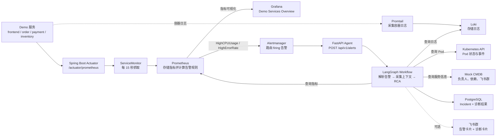

# Ops AI Agent

智能运维 Agent 系统：接收监控告警，自动采集可观测数据，分析根因，保存
Incident，并按需向飞书群推送卡片通知。

当前实现处于 **Phase 1：只读诊断**。Agent 会给出诊断结论和证据链，但不会
自动修改 Kubernetes 资源或执行处置动作。

## 核心能力

- 接收 Alertmanager Webhook，创建并去重 Incident。
- 查询 Prometheus、Loki、Kubernetes 和 Mock CMDB，采集诊断上下文。
- 优先调用 DeepSeek 生成根因分析；LLM 不可用时回退到规则诊断。
- 将 Incident、根因、置信度和证据链保存到 PostgreSQL。
- 可选推送飞书告警卡片和诊断结果卡片。
- 提供四个 Spring Boot 样例服务和 CPU、内存、错误、延迟故障注入接口。
- 使用 `./ops.sh` 管理完整的本地 Kind 演示环境。

## 技术栈

| 层次 | 组件 |
|------|------|
| Agent | Python 3.11+、FastAPI、LangGraph |
| LLM | DeepSeek OpenAI Compatible API |
| 数据层 | PostgreSQL 16、Redis 7 |
| 可观测 | Prometheus、Grafana、Alertmanager、Loki、Promtail |
| 样例业务 | Java 17、Spring Boot 3.3、Micrometer |
| 消息通道 | 飞书 Open API |
| 基础设施 | Docker、Kind、Kubernetes、Helm |

## 监控告警流程



## 快速开始

### 1. 安装依赖

| 依赖 | 用途 |
|------|------|
| Docker + Compose v2 | PostgreSQL、Redis 和 Kind 节点 |
| `kubectl` | 操作本地 Kubernetes 集群 |
| `kind` | 创建本地 Kubernetes 集群 |
| `helm` | 部署可观测栈 |
| Maven | 构建 Java 样例服务 |
| Python 3 | 运行 Agent 和本地脚本 |
| `curl` | 健康检查和演示请求 |

macOS 可使用 Homebrew：

```bash
brew install docker kind helm kubectl maven python
```

Linux 请使用发行版包管理器安装对应依赖。执行脚本前，需要先启动 Docker
Desktop 或本机 Docker 服务。

### 2. 首次启动

```bash
cp .env.example .env
# 可选：编辑 .env，填入 DeepSeek 和飞书配置

./ops.sh bootstrap
```

`bootstrap` 会自动准备 Python 虚拟环境、PostgreSQL、Redis、Kind 集群、
Prometheus、Alertmanager、Grafana、Loki、Promtail、四个 Demo 服务和
Agent。首次构建需要下载镜像与 Maven 依赖，耗时会比日常启动更长。

### 3. 验证环境

```bash
./ops.sh status
```

正常情况下，可以看到：

- PostgreSQL 和 Redis 状态为 `healthy`。
- Kind 的三个节点状态为 `Ready`。
- Agent、Prometheus、Alertmanager、Loki、Grafana 和 `order-service`
  端点状态为 `正常`。
- 四个 Demo Deployment 均为 `2/2`。
- Prometheus 显示 `8/8 targets UP`。

## 使用 Grafana

Grafana 首页：

[http://localhost:30030](http://localhost:30030)

本地演示环境默认账号：

```text
admin / admin123
```

> 该密码仅用于本地 Kind 演示环境。部署到共享或生产环境前必须修改。

优先打开项目自带的业务看板：

[Demo Services Overview](http://localhost:30030/d/demo-services/demo-services-overview)

如果已经进入 Grafana 的 Dashboards 列表，可以搜索 `Demo Services Overview`。
不要只停留在 `Kubernetes / ...` 通用看板列表中。

| 面板 | 含义 | 使用提示 |
|------|------|----------|
| `CPU Usage` | 四个 Demo 服务的进程 CPU 使用情况 | 执行 `./ops.sh test` 时可观察 `order-service` 波动 |
| `Request Rate` | HTTP 请求速率 | 包含健康检查和 Prometheus 抓取请求 |
| `Error Rate` | 5xx 错误率 | 没有错误请求时显示 `No data`，属于正常现象 |

查看 Kubernetes 资源时，可打开 `Kubernetes / Compute Resources / Namespace
(Pods)`，并选择 namespace `demo`。

## 常用命令

| 命令 | 说明 |
|------|------|
| `./ops.sh bootstrap` | 首次初始化并启动完整本地环境 |
| `./ops.sh start` | 启动已有环境，不重新构建 Demo 镜像 |
| `./ops.sh restart` | 重启 Agent、proxy 和 port-forward |
| `./ops.sh stop` | 停止后台进程和 Docker Compose，保留数据与 Kind 集群 |
| `./ops.sh status` | 查看组件健康状态、Demo Pod 和配置提示 |
| `./ops.sh logs agent` | 持续查看 Agent 日志 |
| `./ops.sh logs grafana` | 持续查看 Grafana port-forward 日志 |
| `./ops.sh demo start` | 构建、加载并部署 Demo 服务 |
| `./ops.sh demo stop` | 删除 Demo namespace |
| `./ops.sh demo restart` | 重新构建并部署 Demo 服务 |
| `./ops.sh test` | 执行真实 CPU 故障注入端到端测试 |
| `./ops.sh clean` | 停止服务并删除 Kind 集群，保留数据库卷 |
| `./ops.sh clean --all` | 同时删除 PostgreSQL 和 Redis 数据卷 |
| `./ops.sh help` | 查看完整命令说明 |

脚本会在仓库根目录生成 `.ops/pids/` 和 `.ops/logs/`。它只停止自己记录的
后台进程，不会使用宽泛的 `pkill` 影响其他本地环境。

## 运行端到端演示

```bash
./ops.sh status
./ops.sh test
```

`test` 会向一个 `order-service` Pod 注入 CPU 故障，等待
`HighCPUUsage` 告警经由 Prometheus 和 Alertmanager 到达 Agent，检查新建
Incident 和诊断结果，最后自动重置故障。

演示期间可以同时观察：

- [Grafana 业务看板](http://localhost:30030/d/demo-services/demo-services-overview)
- [Prometheus Alerts](http://localhost:9090/alerts)
- [Agent Incident API](http://localhost:8000/api/v1/incidents)
- Agent 日志：`./ops.sh logs agent`

## 可选配置

复制 `.env.example` 后，可以按需配置：

| 配置项 | 是否必填 | 说明 |
|--------|----------|------|
| `DEEPSEEK_API_KEY` | 否 | 配置后启用 LLM 根因分析；留空或不可用时使用规则兜底 |
| `DEEPSEEK_BASE_URL` | 否 | DeepSeek OpenAI Compatible API 地址 |
| `DEEPSEEK_MODEL` | 否 | 使用的 DeepSeek 模型 |
| `FEISHU_APP_ID` | 否 | 飞书应用 ID |
| `FEISHU_APP_SECRET` | 否 | 飞书应用密钥 |
| `SERVICE_CHAT_IDS` | 否 | 服务到飞书群 `chat_id` 的 JSON 映射 |

飞书卡片通知需要同时配置应用凭证、将 Bot 加入目标群聊，并在 `.env` 中加入
真实群聊映射。例如：

```bash
SERVICE_CHAT_IDS='{"frontend-service":"oc_xxx","order-service":"oc_xxx","payment-service":"oc_xxx","inventory-service":"oc_xxx"}'
```

未配置飞书时，告警接收、自动诊断和 Incident 保存仍然可用。不要将包含真实
密钥的 `.env` 提交到 Git。

如果点击诊断卡片里的「批准执行」「拒绝」「转人工」时弹出卡片回调配置提示，
请按 [飞书卡片回调配置指南](docs/feishu-card-callback.md) 配置公网 HTTPS 回调地址。

## 常用地址

| 服务 | 地址 |
|------|------|
| Agent API | [http://localhost:8000](http://localhost:8000) |
| Agent API 文档 | [http://localhost:8000/docs](http://localhost:8000/docs) |
| Incident 列表 | [http://localhost:8000/api/v1/incidents](http://localhost:8000/api/v1/incidents) |
| Prometheus | [http://localhost:9090](http://localhost:9090) |
| Prometheus Targets | [http://localhost:9090/targets](http://localhost:9090/targets) |
| Alertmanager | [http://localhost:9093](http://localhost:9093) |
| Loki | [http://localhost:3100](http://localhost:3100) |
| Grafana | [http://localhost:30030](http://localhost:30030) |
| Grafana 业务看板 | [Demo Services Overview](http://localhost:30030/d/demo-services/demo-services-overview) |

## API

| 端点 | 方法 | 说明 |
|------|------|------|
| `/health` | `GET` | Agent 健康检查 |
| `/api/v1/alerts` | `POST` | Alertmanager Webhook 回调 |
| `/api/v1/incidents` | `GET` | 查询 Incident 列表，支持 `?status=` 过滤 |
| `/api/v1/incidents/{id}` | `GET` | 查询 Incident 详情，包含诊断结论和证据链 |

完整接口可在 Agent 启动后访问
[Swagger UI](http://localhost:8000/docs)。

## 开发与测试

```bash
# Shell 管理脚本回归
bash -n ops.sh
bash scripts/tests/test_ops.sh

# Python Agent 回归
.venv/bin/python -m unittest \
  tests/test_alert_workflow.py \
  tests/test_local_http_clients.py \
  tests/test_prometheus_tool.py \
  tests/test_templates.py \
  tests/test_feishu.py \
  -v
```

## 项目结构

```text
ops-ai-agent/
├── agent/                  # Python Agent 服务
│   ├── agents/             # 告警解析、上下文采集和 RCA
│   ├── api/v1/             # Webhook 和 Incident API
│   ├── channels/           # 飞书 SDK 封装
│   ├── db/                 # SQLAlchemy ORM 和迁移脚本
│   ├── llm/                # DeepSeek LLM 适配层
│   ├── templates/cards/    # 飞书卡片模板
│   ├── tools/              # Prometheus、Loki、Kubernetes 和 CMDB 工具
│   └── workflows/          # LangGraph 状态图
├── demo-services/          # Java Spring Boot 样例微服务
├── k8s/
│   ├── demo-services/      # Demo Deployment、Service 和 ServiceMonitor
│   └── monitoring/         # 可观测栈配置
├── scripts/tests/          # ops.sh Shell 回归
├── tests/                  # Python 回归和端到端测试
├── ops.sh                  # 本地环境一键管理入口
├── docker-compose.yml      # PostgreSQL 和 Redis
└── kind-config.yaml        # Kind 集群配置
```

## 常见问题

### Grafana 看不到 Demo 服务

先执行：

```bash
./ops.sh status
```

确认 Prometheus 显示 `8/8 targets UP`，再打开
[Demo Services Overview](http://localhost:30030/d/demo-services/demo-services-overview)。
`Error Rate` 没有 5xx 错误时显示 `No data`，不代表采集失败。

### Prometheus Targets 不是 `8/8`

```bash
./ops.sh demo restart
./ops.sh status
```

如果仍未恢复，打开 [Prometheus Targets](http://localhost:9090/targets)，搜索
`demo` 查看具体抓取失败的 Pod。

### 飞书收不到卡片

确认 `FEISHU_APP_ID`、`FEISHU_APP_SECRET` 和 `SERVICE_CHAT_IDS` 已配置，Bot
已经加入目标群聊，然后查看：

```bash
./ops.sh logs agent
```

### 修改 Java Demo 后如何更新

```bash
./ops.sh demo restart
```

该命令会重新构建镜像、加载到 Kind、滚动重启 Deployment，并恢复本地
`order-service` port-forward。

## 深入文档

- [手工部署与详细排障](docs/deployment.md)
- [技术实现方案](docs/运维%20Agent%20技术实现方案.md)
- [产品需求文档](docs/运维%20Agent%20产品需求文档（PRD）.md)
- [架构分析](docs/关于运维%20Agent%20的架构分析.md)

## 路线图

| Phase | 核心交付 |
|-------|----------|
| Phase 1 | 只读诊断：告警 → 上下文采集 → RCA → Incident → 飞书通知 |
| Phase 2 | 处置方案：Runbook 匹配 → 风险评估 → 人工审批 |
| Phase 3 | 自动执行：处置执行 → 效果验证 → 案例沉淀 |
