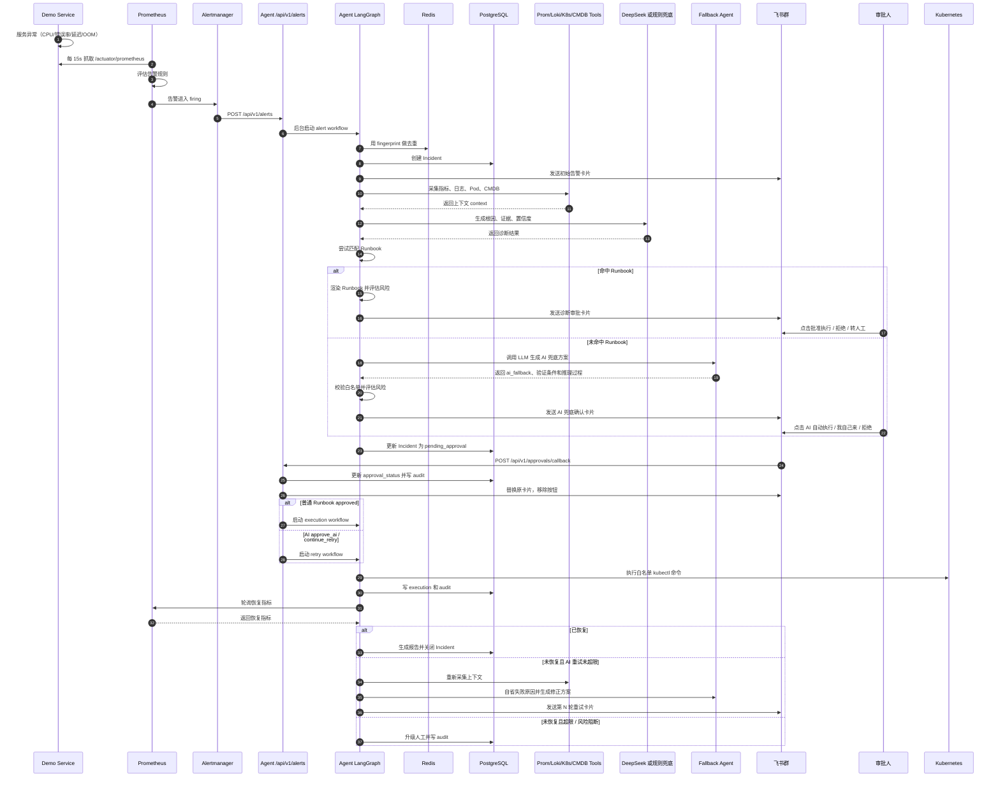

# 告警诊断与处置完整流程

> 本文说明当前项目中，服务产生告警后，从“被监控系统感知”到“Agent 诊断、Runbook / AI 兜底、飞书确认、自动执行、失败重试、恢复验证、报告沉淀”的完整链路。
>
> 重点回答四个问题：
>
> - 服务异常后，谁最先感知？
> - 感知之后，哪些组件负责把告警送到 Agent？
> - Agent 收到告警后如何收集信息和排查？
> - 飞书确认后，自动执行、失败重试、验证和报告如何继续推进？

## 1. 一句话概览

当前链路是：

```text
Demo 服务暴露指标
  → Prometheus 定时采集并评估告警规则
  → Alertmanager 接收 firing 告警并 Webhook 调用 Agent
  → Agent 创建 Incident、采集 Prometheus/Loki/K8s/CMDB 上下文
  → Agent 调用 LLM 或规则兜底做根因分析
  → Agent 优先匹配 Runbook；未命中时调用 AI 兜底生成处置方案
  → Agent 评估风险、发送飞书确认卡片
  → 人在飞书点击批准 / AI 自动执行 / 我自己来 / 拒绝 / 转人工
  → Agent 执行白名单命令、验证恢复；未恢复时进入 AI 自省重试
  → 恢复后生成故障报告，失败或超限时升级人工
```

需要注意：**业务服务不会主动调用 Agent**。业务服务只暴露指标和健康检查；真正发现告警的是 Prometheus，真正调用 Agent 的是 Alertmanager。

### 1.1 适用范围

这份文档描述的是当前项目的 **通用告警处理主链路**。CPU 告警只是文档中展开最细的 Runbook 样例；未知告警会走 AI 兜底分支，覆盖 `2026-06-06-ai-fallback-strategy-design.md` 已完成的 AI 方案生成、飞书确认、失败自省、重试循环和审计可观测能力。

对当前项目来说，所有接入 `/api/v1/alerts` 的告警都会经过同一条主链路：

```text
Alertmanager Webhook
  → Agent parse_alert
  → Redis 去重
  → PostgreSQL Incident
  → Prometheus / Loki / Kubernetes / CMDB 上下文采集
  → RCA 诊断
  → Runbook 命中：Runbook + Risk
  → Runbook 未命中：AI Fallback + Risk
  → 飞书确认
  → 确认后执行 / 验证 / AI 重试 / 报告 / 转人工
```

不同告警类型的差异主要在四个地方：

- Prometheus 告警规则不同。
- 匹配的 Runbook 不同；未命中 Runbook 时进入 AI 兜底。
- 风险评分可能不同。
- 恢复验证指标和阈值不同；AI 兜底方案可以携带自己的验证条件。

当前代码层面的支持情况：

| 告警类型 | 典型告警名 | Runbook | 恢复验证指标 | 当前说明 |
|----------|------------|---------|--------------|----------|
| CPU 高 | `HighCPUUsage` | `cpu_high.md` | CPU `< 70%` | 当前文档的完整样例 |
| 错误率高 | `HighErrorRate` | `error_rate.md` | 错误率 `< 2%` | Alertmanager 默认已路由到 Agent |
| 延迟高 | `HighLatency` / `P99` / `RT` | `latency_high.md` | 平均 RT `< 1s` | Runbook 和验证逻辑已支持，默认告警路由需按需补充 |
| OOM / 内存 | `OOMKilled` / `OOM` / `Memory` | `oom.md` | memory 阈值 | Runbook 已支持；当前内存验证指标仍偏演示化，后续可细化为容器内存使用率 |
| 未知告警 | `DiskPressure` / `ThreadPoolExhausted` 等 | `ai_fallback` | AI 方案内 `verification` | 已支持：LLM 生成方案，飞书确认后执行，失败可重试 |

## 2. 核心组件职责

| 组件 | 职责 | 对应代码或配置 |
|------|------|----------------|
| Demo 服务 | 暴露 `/actuator/prometheus` 指标，模拟 CPU、错误率、延迟等故障 | `demo-services/*`、`FaultController.java` |
| Micrometer / Actuator | 把 JVM、HTTP、CPU 等指标导出成 Prometheus 格式 | `application.yml` |
| ServiceMonitor | 告诉 Prometheus 去采集哪些服务、哪个端口、哪个路径 | `k8s/demo-services/*-deployment.yaml` |
| Prometheus | 周期性抓取指标，执行告警规则 | `k8s/monitoring/prometheus-values.yaml` |
| Alertmanager | 接收 Prometheus firing 告警，按路由配置调用 Agent Webhook | `k8s/monitoring/prometheus-values.yaml` |
| Agent API | 接收 Alertmanager Webhook，启动后台诊断工作流 | `agent/api/v1/alerts.py` |
| LangGraph 工作流 | 串联 parse、collect_context、diagnose 等节点 | `agent/workflows/alert_workflow.py` |
| Redis | 根据 Alertmanager fingerprint 做告警去重 | `agent/agents/alert.py` |
| PostgreSQL | 保存 Incident、执行记录、报告、审计日志 | `agent/db/models.py` |
| Prometheus Tool | 查询 CPU、内存、QPS、RT、错误率 | `agent/tools/prometheus.py` |
| Loki Tool | 查询服务 ERROR 日志 | `agent/tools/loki.py` |
| Kubernetes Tool | 查询 Pod 状态、就绪数、重启次数 | `agent/tools/kubernetes.py` |
| CMDB Tool | 查询负责人、团队、依赖、飞书群 | `agent/tools/cmdb.py` |
| RCA Agent | 调用 LLM 或规则兜底生成根因、置信度、证据 | `agent/agents/rca.py` |
| Runbook Agent | 根据告警名匹配处置模板，并渲染命令 | `agent/agents/runbook.py` |
| Fallback Agent | 未命中 Runbook 时生成 AI 兜底方案；执行失败后自省并生成修正方案 | `agent/agents/fallback.py` |
| Risk Agent | 根据命令、服务、环境、告警级别评估风险 | `agent/agents/risk.py` |
| Feishu Channel | 发送告警卡片、诊断审批卡片、AI 兜底卡片、重试卡片，更新审批结果卡片 | `agent/channels/feishu.py` |
| Approval API | 接收飞书按钮回调，更新审批状态，触发执行或 AI 重试工作流 | `agent/api/v1/approvals.py` |
| Executor | 执行白名单内的 kubectl 变更命令 | `agent/agents/executor.py` |
| Retry Workflow | AI 方案执行后未恢复时，编排执行、验证、自省、发重试卡片、超限升级 | `agent/workflows/retry_workflow.py` |
| Verify | 执行后轮询 Prometheus 判断是否恢复，支持 AI 方案动态验证阈值 | `agent/agents/verify.py` |
| Report | 生成 Markdown 故障报告并沉淀故障模式 | `agent/agents/report.py` |
| Audit API | 查询某个 Incident 的审批、执行、重试和报告审计时间线 | `agent/api/v1/audit.py` |

## 3. 完整时序图



## 4. 第一段：服务如何产生可观测告警

### 4.1 Demo 服务如何产生异常

当前项目的 Demo 服务是 Spring Boot 应用，可以模拟 CPU、错误率、延迟和内存类异常。以 `order-service` 的 CPU 故障为例：

- 监听端口：`8081`
- 健康检查：`/actuator/health`
- Prometheus 指标：`/actuator/prometheus`
- CPU 故障注入：`/fault/cpu?enable=true`
- 错误率故障注入：`/fault/error?enable=true`
- 延迟故障注入：`/fault/latency?ms=5000`
- 内存故障注入：`/fault/memory?mb=10`

CPU 故障由 `FaultController` 模拟：

```java
while (cpuBurning) {
    // busy loop
}
```

这会让容器内应用线程持续空转，进而拉高 `process_cpu_usage` 指标。其他故障也会通过 Actuator / Micrometer 暴露为 HTTP、JVM 或应用指标，被 Prometheus 采集后用于告警判断。

### 4.2 指标如何暴露给 Prometheus

`order-service` 的配置中开启了 Actuator 指标：

```yaml
management:
  endpoints:
    web:
      exposure:
        include: health,prometheus,metrics
  metrics:
    tags:
      service: order-service
```

这会给每条指标打上 `service=order-service` 标签。后续 Prometheus 查询和告警规则都依赖这个标签识别服务。

### 4.3 Prometheus 如何发现服务

Kubernetes Deployment / Service / ServiceMonitor 中配置了：

```yaml
annotations:
  prometheus.io/scrape: "true"
  prometheus.io/port: "8081"
  prometheus.io/path: "/actuator/prometheus"
```

并且 ServiceMonitor 明确告诉 Prometheus：

```yaml
endpoints:
  - port: http
    path: /actuator/prometheus
    interval: 15s
```

所以 Prometheus 会周期性抓取：

```text
http://order-service.demo.svc:8081/actuator/prometheus
```

## 5. 第二段：谁感知告警

**Prometheus 是第一感知方。**

它不是收到服务主动上报，而是自己定时抓取指标，然后执行告警规则。以 CPU 告警为例：

```yaml
- alert: HighCPUUsage
  expr: process_cpu_usage * 100 > 90
  for: 1m
  labels:
    severity: P2
  annotations:
    summary: "{{ $labels.service }} CPU > 90%"
    service: "{{ $labels.service }}"
```

含义是：

1. Prometheus 查询 `process_cpu_usage`。
2. 如果 CPU 使用率大于 90%。
3. 并且持续 1 分钟。
4. 就生成名为 `HighCPUUsage` 的告警。
5. 告警级别标记为 `P2`。
6. 告警携带 `service` 标签，告诉下游是哪一个服务异常。

这个阶段还没有 Agent 参与。错误率、延迟、OOM 等场景也是同样模式：Prometheus 先根据指标和规则判断告警是否 firing。

## 6. 第三段：谁调用 Agent

**Alertmanager 调用 Agent。**

Prometheus 只负责产生告警；真正负责通知下游系统的是 Alertmanager。

当前 Alertmanager 路由配置：

```yaml
route:
  receiver: "null"
  group_by: ["alertname", "service"]
  group_wait: 10s
  group_interval: 10s
  repeat_interval: 5m
  routes:
    - receiver: "ops-agent-webhook"
      matchers:
        - alertname =~ "HighCPUUsage|HighErrorRate"
receivers:
  - name: "ops-agent-webhook"
    webhook_configs:
      - url: "http://host.docker.internal:8000/api/v1/alerts"
        send_resolved: true
```

这里有几个关键点：

- 当前默认配置只有 `HighCPUUsage` 和 `HighErrorRate` 会路由到 Agent。
- 代码层面已经支持 CPU、错误率、延迟、OOM/内存类 Runbook；如果要让延迟或 OOM 真实进入 Agent，需要在 Alertmanager route 和 PrometheusRule 中补充对应告警规则。
- `group_wait: 10s` 表示新告警会先等 10 秒再发送，避免过于碎片化。
- `repeat_interval: 5m` 表示同一组告警持续 firing 时，Alertmanager 可能每 5 分钟重复通知。
- Webhook 地址是 `http://host.docker.internal:8000/api/v1/alerts`，也就是本机 Agent。
- Agent 对外监听本地 `8000` 端口。

所以这一步的调用方向是：

```text
Alertmanager → Agent FastAPI → POST /api/v1/alerts
```

## 7. 第四段：Agent API 收到告警后做什么

Agent 的入口在：

```text
POST /api/v1/alerts
```

代码会读取 Alertmanager payload 中的 `alerts` 数组，并把每条告警归一化成内部结构：

```python
alert_data = {
    "alertname": "...",
    "service": "...",
    "env": "...",
    "severity": "...",
    "value": "...",
    "starts_at": "...",
    "fingerprint": "...",
}
```

然后 Agent 不会在 HTTP 请求里同步完成整个诊断，而是把诊断任务丢到 FastAPI `BackgroundTasks`：

```text
Webhook 请求快速返回 accepted
后台任务继续跑完整诊断工作流
```

这避免了 Alertmanager 等待太久导致 webhook 超时。

## 8. 第五段：Agent 工作流总览

当前告警诊断工作流由 LangGraph 串起来：

```text
parse_alert
  → collect_context
  → diagnose
  → END
```

对应节点：

| 节点 | 作用 |
|------|------|
| `parse_alert` | 解析告警、去重、创建 Incident、发送初始告警卡片 |
| `collect_context` | 收集 Prometheus、Loki、K8s、CMDB 上下文 |
| `diagnose` | RCA 根因分析、Runbook 匹配或 AI 兜底、风险评估、保存诊断、发送确认卡片 |

如果在 `parse_alert` 阶段发现是重复告警，工作流会直接结束，不再重复采集、诊断和发飞书诊断卡片。

`diagnose` 节点内部会出现两条方案生成分支：

```text
RCA 诊断结果
  → 尝试 load_runbook(alert_name)
    → 命中：渲染 Runbook 步骤 → Risk 评估 → 飞书普通审批卡片
    → 未命中：调用 Fallback Agent → AI 方案校验 → Risk 评估 → 飞书 AI 兜底卡片
```

这里的 AI 兜底并不会绕过人。它只是把“没有预置 Runbook”的告警也转成可确认、可执行、可验证的结构化方案。

## 9. 第六段：parse_alert 如何创建 Incident 和去重

`parse_alert` 会调用：

```text
agent/agents/alert.py::parse_and_create_incident
```

核心逻辑如下：

1. 从告警中读取 `fingerprint`。
2. 构造 Redis key：

```text
alert:dedup:{fingerprint}
```

3. 如果 Redis 已有这个 key：

```text
说明同一个 firing 告警已经处理过
复用原 Incident ID
设置 duplicate_alert=True
工作流结束
```

4. 如果 Redis 没有这个 key：

```text
先写入去重占位
创建 Incident
把 Redis key 更新成真实 incident_id
继续后续诊断
```

默认去重窗口：

```text
ALERT_DEDUP_WINDOW=300 秒
```

也就是说，5 分钟内同一个 Alertmanager fingerprint 不会重复触发完整诊断。

### 9.1 Incident 初始状态

新建 Incident 时会写入告警的结构化字段。以 CPU 告警为例：

| 字段 | 示例 |
|------|------|
| `service` | `order-service` |
| `env` | `prod` |
| `severity` | `P2` |
| `alert_name` | `HighCPUUsage` |
| `alert_value` | `order-service CPU > 90%` |
| `status` | `diagnosing` |

### 9.2 初始飞书告警卡片

Incident 创建后，Agent 会尝试发送第一张飞书卡片：

```text
告警卡片：告诉群里“某服务发生了某告警，工单号是多少”
```

这张卡片只是告警通知，不是完整诊断结果。

如果飞书发送失败，Agent 会记录日志，但不会阻断数据库里的 Incident 主流程。

## 10. 第七段：collect_context 如何收集排查信息

`collect_context` 会调用：

```text
agent/agents/supervisor.py::collect_context_for_incident
```

它会并行意义上收集四类信息：指标、日志、Pod 状态、服务元数据。不同告警都会先采集同一组上下文，只是在后续 RCA、Runbook 和 Verify 阶段关注的字段不同。

### 10.1 Prometheus 指标

调用：

```text
agent/tools/prometheus.py::query_service_metrics
```

查询项：

| 指标 | PromQL |
|------|--------|
| CPU | `max(process_cpu_usage{service="order-service"}) * 100` |
| 内存 | `jvm_memory_used_bytes{service="order-service"}` |
| QPS | `rate(http_server_requests_seconds_count{service="order-service"}[5m])` |
| 平均 RT | `rate(http_server_requests_seconds_sum[5m]) / rate(http_server_requests_seconds_count[5m])` |
| 错误率 | `rate(http_server_requests_seconds_count{status=~"5.."}[5m]) / rate(http_server_requests_seconds_count[5m])` |

这些指标用于判断：

- CPU 是否真的高。
- CPU 高是否伴随 QPS 上涨。
- 是否有错误率升高。
- 是否存在延迟问题。
- 是否可能是资源不足、流量上涨、应用死循环或下游异常。

对于错误率告警，Agent 会更关注 `error_rate` 和 ERROR 日志；对于延迟告警，会更关注 `rt_avg`、QPS 和依赖服务；对于 OOM/内存类告警，会更关注 JVM 内存、Pod 重启次数和 Kubernetes 状态。

### 10.2 Loki 日志

调用：

```text
agent/tools/loki.py::query_service_logs
```

默认查询：

```logql
{app="order-service"} |= "ERROR"
```

时间窗口：

```text
最近 10 分钟
```

最大返回：

```text
50 条
```

这些日志会进入 LLM Prompt，帮助判断是否存在异常堆栈、依赖错误、数据库连接错误等。

### 10.3 Kubernetes Pod 状态

调用：

```text
agent/tools/kubernetes.py::get_service_pods
```

查询方式：

```text
GET http://localhost:8001/api/v1/namespaces/demo/pods?labelSelector=app=order-service
```

这里的 `localhost:8001` 是 `ops.sh` 启动的 `kubectl proxy`。

采集字段：

| 字段 | 含义 |
|------|------|
| `total` | Pod 总数 |
| `ready` | Ready Pod 数 |
| `phase` | Pod phase |
| `restarts` | 容器重启次数 |
| `node` | Pod 所在节点 |

这些信息用于判断：

- 是所有 Pod 都异常，还是只有个别 Pod 异常。
- Pod 是否 NotReady。
- 是否存在 CrashLoopBackOff、频繁重启等情况。
- 当前服务副本数是多少，Runbook 扩容建议会依赖它。

### 10.4 CMDB 服务信息

调用：

```text
agent/tools/cmdb.py::get_service_info
```

当前是 Mock CMDB，返回：

| 字段 | 含义 |
|------|------|
| `owner` | 服务负责人 |
| `team` | 所属团队 |
| `dependencies` | 依赖服务 |
| `oncall` | 值班人 |
| `chat_id` | 飞书群 |

飞书群优先从 `.env` 的 `SERVICE_CHAT_IDS` 读取，没有才回退 Mock CMDB。

## 11. 第八段：Agent 如何做根因分析

`diagnose` 节点会调用：

```text
agent/agents/rca.py::analyze_root_cause
```

整体分四步：

```text
1. LLM 或规则兜底生成根因
2. 匹配 Runbook 并渲染处置步骤
3. 评估风险
4. 保存结果并发送飞书诊断审批卡片
```

### 11.1 LLM 诊断 Prompt 包含什么

Agent 会把告警和上下文拼成 Prompt。以 CPU 告警为例，Prompt 会包含：

- 告警名称：`HighCPUUsage`
- 服务：`order-service`
- 环境：`prod`
- 级别：`P2`
- 告警值：`order-service CPU > 90%`
- CPU 当前值
- 内存当前值
- QPS 当前值
- 平均响应时间
- 错误率
- Pod 总数和 Ready 数
- Pod 明细
- 近 20 条 ERROR 日志
- CMDB 负责人、团队、依赖

LLM 被要求输出严格 JSON：

```json
{
  "root_cause": "根因描述",
  "confidence": 0.85,
  "evidence": ["证据1", "证据2", "证据3"]
}
```

### 11.2 LLM 不可用时怎么排查

如果 DeepSeek 或 LLM 请求失败，Agent 会走规则兜底：

| 条件 | 兜底判断 |
|------|----------|
| CPU 告警 + QPS 高 + Pod 全部健康 | 倾向判断为流量上涨导致资源不足 |
| CPU 告警 + Pod 不健康 + QPS 低 | 倾向判断为单实例异常或代码死循环 |
| 其他情况 | 输出低置信度结论，建议人工确认 |

当前规则兜底对 CPU 场景最完整；其他告警类型也会得到低置信度兜底结果，并继续尝试 Runbook、风险评估和审批流程。所以即使没有配置 DeepSeek，Agent 也能继续完成已有 Runbook 的基本诊断流程。需要注意：AI 兜底方案和失败自省重试依赖 LLM，未配置可用 LLM 时无法生成高质量 `ai_fallback` / `ai_retry` 方案。

## 12. 第九段：Runbook / AI 兜底如何生成处置方案

RCA 完成后，Agent 会先根据告警名称匹配 Runbook。

当前匹配关系：

| 告警关键词 | Runbook | 说明 |
|------------|---------|------|
| `HighCPUUsage` / `CPU` | `cpu_high.md` | CPU 高负载 |
| `HighErrorRate` / `ERROR` | `error_rate.md` | 错误率过高 |
| `HighLatency` / `LATENCY` / `P99` / `RT` | `latency_high.md` | 延迟升高 |
| `OOMKilled` / `OOM` / `MEMORY` | `oom.md` | OOM 或内存异常 |

以 CPU 告警为例，会匹配：

```text
runbooks/cpu_high.md
```

其中包含：

```text
1. 查看 Grafana Dashboard
2. 检查 Pod 状态
3. 如果所有 Pod CPU 均高且 QPS 上涨，扩容服务
4. 如果仅个别 Pod CPU 高，重启异常 Pod
5. 如果扩容后仍未缓解，检查依赖服务状态和数据库连接池
6. 故障恢复后记录时间线和根因
```

Runbook 里的模板变量会被运行时上下文替换：

| 模板变量 | 示例替换 |
|----------|----------|
| `{{service}}` | `order-service` |
| `{{namespace}}` | `demo` |
| `{{replicas}}` | `4` |
| `{{original_replicas}}` | `2` |
| `{{pod_name}}` | `order-service-xxx` |

例如：

```bash
kubectl scale deployment order-service -n demo --replicas=4
```

当前项目为了避免本地 Kind 环境被连续 E2E 扩容压爆，Demo 扩容建议最多收敛到 4 副本。

### 12.1 未命中 Runbook 时如何 AI 兜底

如果 `load_runbook()` 返回 `None`，Agent 不再让工单悬空，而是调用：

```text
agent/agents/fallback.py::generate_ai_action_plan
```

Fallback Agent 会把 RCA 结果、指标、日志、Pod 状态和 CMDB 信息交给 LLM，要求它输出严格 JSON：

```json
{
  "reasoning": "为什么这样处理",
  "steps": [
    {
      "risk_level": "中风险",
      "description": "扩容 order-service 分摊负载",
      "command": "kubectl scale deployment order-service -n demo --replicas=4"
    }
  ],
  "verification": {
    "metric": "cpu",
    "operator": "<",
    "threshold": 70.0,
    "description": "CPU 使用率降至 70% 以下"
  },
  "confidence": 0.75
}
```

LLM 输出会先经过结构化校验：

- `steps` 必须是非空列表。
- 每一步必须包含风险等级、说明和命令。
- 命令必须以白名单前缀开头。
- 验证指标只能是 `cpu`、`memory`、`qps`、`rt_avg`、`error_rate`。
- 验证操作符只能是 `<` 或 `>`。

校验通过后，方案会被标记为：

```json
{
  "name": "ai_fallback",
  "ai_generated": true,
  "ai_reasoning": "LLM 推理过程",
  "verification": {}
}
```

随后继续进入 Risk Agent。AI 高风险方案会自动收紧执行权限；用户即使看到方案，也需要在飞书里明确确认。

## 13. 第十段：风险评估如何决定是否允许自动执行

Risk Agent 会综合这些因素：

- 命令是否在白名单内。
- 命令风险等级。
- 告警级别。
- 服务是否核心服务，例如 `order-service`、`payment-service`。
- 环境是否生产环境。

风险评估会输出：

```json
{
  "level": "极高风险",
  "score": 85,
  "allowed": false,
  "warnings": ["生产环境执行高风险操作，建议双人审批"]
}
```

如果 `allowed=false`，即使用户点击批准，自动执行也会被阻断并升级人工。

## 14. 第十一段：诊断结果如何保存和通知

诊断阶段会更新 Incident：

| 字段 | 说明 |
|------|------|
| `root_cause` | 根因描述 |
| `confidence` | 置信度 |
| `evidence` | 证据列表 |
| `runbook_name` | 匹配到的 Runbook；AI 兜底时为 `ai_fallback` 或 `ai_retry` |
| `action_plan` | 渲染后的处置步骤 |
| `risk_assessment` | 风险评估 |
| `status` | `pending_approval` |
| `approval_status` | `pending` |
| `ai_generated` | 是否为 AI 生成方案 |
| `ai_reasoning` | AI 兜底或重试自省的推理摘要 |
| `retry_count` | 当前 AI 重试轮次 |
| `retry_history` | 每轮执行、验证和失败分析摘要 |

随后 Agent 会发送第二张飞书卡片。卡片类型取决于方案来源：

| 方案来源 | 飞书卡片 | 主要按钮 |
|----------|----------|----------|
| Runbook 命中 | 诊断审批卡片 | `批准执行` / `拒绝` / `转人工` |
| AI 兜底 | AI 自主诊断卡片 | `AI 自动执行` / `我自己来` / `拒绝` |

这张卡片包含：

- 根因判断
- 处置方案
- 风险等级
- 证据
- 置信度
- 普通 Runbook：风险等级、Runbook 方案和批准按钮。
- AI 兜底：AI 推理过程、验证条件、置信度和“AI 自动执行 / 我自己来”按钮。

这一步如果发送失败，数据库中的诊断结果仍然存在，只是飞书群看不到诊断或 AI 兜底确认卡片。

## 15. 第十二段：飞书按钮如何回调 Agent

飞书卡片按钮点击后，飞书会调用：

```text
POST /api/v1/approvals/callback
```

按钮值中包含：

```json
{
  "action": "approve_ai",
  "incident_id": "INC-xxxx"
}
```

Agent 收到后会做几件事：

1. 校验是否是飞书卡片回调。
2. 解析按钮动作。
3. 把动作映射成审批状态：

| action | approval_status |
|--------|-----------------|
| `approve` | `approved` |
| `approve_ai` | `ai_approved` |
| `manual_fix` | `manual_executing` |
| `continue_retry` | `retry_continue` |
| `stop_retry` | `escalated` |
| `reject` | `rejected` |
| `escalate` | `escalated` |

4. 更新 Incident 状态。
5. 写入审计日志。
6. 尝试把飞书原卡片更新成审批结果卡片，去掉按钮，避免重复点击。
7. 如果是 `approved`，后台启动普通执行工作流。
8. 如果是 `ai_approved` 或 `retry_continue`，后台启动 AI 重试工作流。

飞书回调接口兼容两种回调格式：

- 旧版：`type = card_action`
- 新版：`header.event_type = card.action.trigger`

如果飞书原卡片更新成功，按钮会消失；如果只看到数据库状态已更新但卡片按钮仍可见，优先检查 `update_card` 调用是否成功，以及回调 payload 中是否携带了可用于更新的 `open_message_id`。

## 16. 第十三段：确认后如何自动执行

飞书回调是一个新的 HTTP 请求，已经没有诊断阶段的内存状态。

所以 Agent 会先从 PostgreSQL 恢复执行所需状态：

- Incident 基本信息
- alert 信息
- diagnosis
- runbook
- action_plan
- risk_assessment
- operator

普通 Runbook 的 `approved` 会启动执行工作流：

```text
execute
  → verify
  → generate_report
  → END
```

如果执行失败或验证失败：

```text
execute / verify
  → escalate
  → END
```

AI 兜底或继续重试的 `ai_approved` / `retry_continue` 会启动重试工作流：

```text
retry_execute
  → retry_verify
    → recovered：generate_report → END
    → not recovered 且 retry_count < 5：retry_analyze → 发送重试卡片 → END
    → not recovered 且 retry_count >= 5：escalate → END
```

这个命名里有一点容易误解：首次点击「AI 自动执行」也会走 `retry_workflow`。原因是它需要支持“执行后未恢复就继续自省重试”的闭环，而不是只执行一次就结束。

### 16.1 Executor 的安全边界

Executor 只允许白名单命令：

```text
kubectl scale deployment
kubectl delete pod
kubectl rollout undo
kubectl set resources
kubectl get pods
kubectl describe pod
```

但实际自动执行时，会跳过只读命令：

```text
kubectl get pods
kubectl describe pod
```

并且一次确认只执行第一个“会改变系统状态”的步骤。

这样设计是为了避免一个 Runbook 或 AI 方案中同时有扩容、删 Pod、回滚等多个动作时，被一次确认全部串行执行。

### 16.2 Runbook 的典型执行动作

不同 Runbook 会给出不同处置动作。以 CPU 告警为例，典型自动执行命令是：

```bash
kubectl scale deployment order-service -n demo --replicas=4
```

执行结果会保存到 `executions` 表，并写入审计日志。

## 17. 第十四段：执行后如何验证恢复

执行成功后，`verify` 或 `retry_verify` 节点会轮询 Prometheus。

当前验证指标按告警名称匹配：

| 告警关键词 | 验证指标 | 恢复阈值 | 说明 |
|------------|----------|----------|------|
| `CPU` | `cpu` | `< 70%` | CPU 恢复到安全水位 |
| `ERROR` | `error_rate` | `< 2%` | 错误率恢复 |
| `LATENCY` / `RT` / `P99` | `rt_avg` | `< 1s` | 平均响应时间恢复 |
| `OOM` / `MEMORY` | `memory` | `< 0.85` | 当前为演示阈值，后续可细化为容器内存使用率 |

AI 兜底和 AI 重试方案如果携带了 `verification` 字段，会优先使用方案中的动态阈值。例如未知告警可以让 AI 指定：

```json
{
  "metric": "error_rate",
  "operator": "<",
  "threshold": 0.02,
  "description": "错误率低于 2%"
}
```

以 CPU 告警为例，执行后 Agent 会多次查询：

```text
max(process_cpu_usage{service="order-service"}) * 100
```

如果对应指标降到阈值以下：

```text
recovered=True
status=recovered
```

如果超时仍未恢复：

```text
recovered=False
status=timeout
approval_status=escalated
```

普通 Runbook 验证失败时会转人工处理。AI 兜底方案验证失败时，会先进入失败自省和重试循环；达到 5 轮上限后再自动升级人工。

### 17.1 AI 执行失败后如何重试

AI 方案执行失败或验证未恢复时，Agent 会调用：

```text
agent/agents/fallback.py::analyze_failure_and_retry
```

它会把以下信息交给 LLM：

- 上一轮 AI 方案。
- 上一轮执行结果，包括 stdout、stderr、exit_code。
- 上一轮验证结果，包括指标、当前值、阈值和是否恢复。
- 历史重试摘要。
- 重新采集的 Prometheus、Loki、K8s、CMDB 上下文。

LLM 需要输出新的修正方案、失败原因分析和新的验证条件。Agent 会把它保存到 Incident：

```text
retry_count += 1
retry_history 追加上一轮摘要
runbook_name = ai_retry
approval_status = pending
```

然后发送飞书重试卡片：

```text
第 N/5 轮重试
[继续 AI 执行] [转人工]
```

用户点击「继续 AI 执行」后，Agent 才会执行下一轮修正方案。

## 18. 第十五段：故障报告如何生成

验证通过后进入报告节点：

```text
agent/agents/report.py
```

报告会汇总：

- Incident ID
- 服务和告警名
- 时间线
- 根因
- 置信度
- 证据
- Runbook 处置方案
- 执行结果
- 验证结果
- AI 兜底推理和重试历史
- 后续建议

报告格式是 Markdown，并保存到 `reports` 表。

同时还会沉淀结构化故障模式：

```json
{
  "service": "order-service",
  "alertname": "HighCPUUsage",
  "root_cause": "...",
  "runbook": "cpu_high.md",
  "recovered": true
}
```

这些数据可以在后续作为“历史故障库”查询依据。

## 19. 状态流转

一次普通 Runbook 告警的典型状态流转：

```text
diagnosing
  → pending_approval
  → approved
  → executing
  → executed
  → verified
  → resolved
```

如果风险不允许自动执行：

```text
pending_approval
  → approved
  → escalated
```

如果执行失败：

```text
approved
  → executing
  → execution_failed
  → escalated
```

如果执行成功但验证失败：

```text
executed
  → escalated
```

AI 兜底方案的典型状态流转：

```text
diagnosing
  → pending_approval
  → ai_approved
  → executing
  → executed
  → pending_approval   # 未恢复，生成第 N 轮重试卡片
  → retry_continue
  → executing
  → verified / resolved
```

如果用户选择人工处理：

```text
pending_approval
  → manual_executing
```

如果 AI 重试达到上限：

```text
retry_continue
  → executing
  → executed
  → escalated
```

## 20. 当前告警链路中的关键时间

| 阶段 | 典型耗时 |
|------|----------|
| Prometheus 抓取间隔 | 15 秒 |
| 告警持续条件 | 当前 CPU / 错误率规则为 1 分钟；其他规则按配置决定 |
| Alertmanager group_wait | 10 秒 |
| Agent Webhook 返回 | 立即返回，诊断后台跑 |
| LLM 诊断 | 取决于网络和模型响应 |
| 飞书审批 | 取决于人工点击 |
| 自动执行 kubectl | 默认 60 秒超时 |
| 恢复验证 | 默认最多 300 秒，每 15 秒查一次；AI 重试第 3 轮后最多 450 秒 |
| AI 重试 | 每轮需要人工点击继续，最多 5 轮 |

所以，从服务指标真正异常到飞书收到诊断审批卡片，通常会经历：

```text
指标抓取延迟 + 告警持续条件 + Alertmanager group_wait + Agent 诊断耗时
```

## 21. 如何手动观察每一段

### 21.1 查看服务指标

```bash
curl -s http://localhost:8081/actuator/prometheus | grep process_cpu_usage
```

如果排查错误率或延迟，可以在 `/actuator/prometheus` 中查看 `http_server_requests_seconds_*` 相关指标。

### 21.2 查看 Prometheus 告警

```text
http://localhost:9090/alerts
```

### 21.3 查看 Alertmanager

```text
http://localhost:9093
```

### 21.4 查看 Agent 健康

```bash
curl -s http://localhost:8000/health
```

### 21.5 查看 Incident

```bash
curl -s "http://localhost:8000/api/v1/incidents?limit=5"
```

### 21.6 查看指定 Incident 详情

```bash
curl -s "http://localhost:8000/api/v1/incidents/INC-xxxx"
```

### 21.7 查看执行记录

```bash
curl -s "http://localhost:8000/api/v1/incidents/INC-xxxx/executions"
```

### 21.8 查看报告

```bash
curl -s "http://localhost:8000/api/v1/reports/INC-xxxx?format=markdown"
```

### 21.9 查看审计时间线

```bash
curl -s "http://localhost:8000/api/v1/incidents/INC-xxxx/audit"
```

这里可以看到审批、AI 方案生成、命令执行、恢复验证、重试自省、超限升级等事件。

### 21.10 查看 Agent 日志

```bash
./ops.sh logs agent
```

重点日志关键词：

```text
收到告警 Webhook
启动后台诊断
进入 parse_and_create_incident
告警去重检查
工单已创建
采集上下文
Prometheus 指标完成
Loki 日志完成
Kubernetes Pod 完成
进入根因分析
进入 Fallback Agent
Fallback Agent 方案生成完成
处置方案已生成
诊断结果已保存到数据库
准备发送诊断卡片
收到飞书审批回调
进入 run_execution_workflow
进入 retry_execute
进入 retry_verify
进入 retry_analyze
AI 重试卡片已发送
自动执行完成
恢复验证通过
报告节点完成
```

## 22. 常见误解

### 22.1 是服务主动通知 Agent 吗？

不是。

服务只暴露指标，Prometheus 主动抓取。告警触发后，由 Alertmanager 调用 Agent。

### 22.2 Agent 是 Prometheus 的一部分吗？

不是。

Agent 是独立 FastAPI 服务，Prometheus/Alertmanager 只是把告警 Webhook 发给它。

### 22.3 飞书审批按钮会直接执行 kubectl 吗？

不会。

飞书按钮只回调 Agent。Agent 更新审批状态后，才由内部执行工作流判断风险、白名单、可执行步骤，然后执行命令。

### 22.4 诊断通知发送失败是否代表诊断失败？

不一定。

如果日志是：

```text
诊断结果已保存到数据库
诊断通知发送失败
诊断完成
```

说明诊断已完成并落库，只是飞书诊断卡片发送失败。

### 22.5 重复告警会不会重复诊断？

同一个 `fingerprint` 在 300 秒去重窗口内不会重复诊断。

重复告警会复用已有 Incident，然后工作流结束。

### 22.6 未命中 Runbook 是否就不能处理？

现在可以继续处理。

未命中 Runbook 时，Agent 会调用 Fallback Agent 生成 `ai_fallback` 方案。这个方案仍然需要通过输出校验、风险评估和飞书人工确认，确认后才会执行。

### 22.7 为什么 AI 自动执行失败后又要我点一次？

因为每一轮修正方案都可能改变处置动作。Agent 会先把失败原因和新方案发到飞书，让人确认后再继续执行，避免 AI 在失败后无人确认地连续改集群。

## 23. 当前链路的边界

当前项目是本地演示和学习系统，安全边界如下：

- 不会绕过人工审批直接改 Kubernetes。
- 只执行白名单 kubectl 命令。
- 只自动执行第一个变更动作。
- AI 兜底方案必须通过结构化校验和风险评估。
- AI 重试每轮都需要飞书确认。
- AI 重试最多 5 轮，超限自动升级人工。
- 风险评估不允许时会升级人工。
- 执行后必须做 Prometheus 恢复验证。
- 普通 Runbook 验证失败会升级人工；AI 兜底验证失败会先进入确认式重试循环。
- 飞书通知失败不影响 Incident 数据落库。
- 本地 Demo 扩容建议最多到 4 副本，避免 Kind 资源耗尽。

## 24. 一条 CPU 告警的完整样例

下面用 CPU 告警作为完整样例。其他告警类型会复用同一条 Agent 主链路，只是在 Prometheus 规则、Runbook / AI 兜底方案和恢复验证指标上不同。

假设 `order-service` 开启 CPU 故障：

```bash
curl -s -X POST "http://localhost:8081/fault/cpu?enable=true"
```

完整链路如下：

1. `order-service` 内部 busy loop，CPU 指标升高。
2. `/actuator/prometheus` 暴露 `process_cpu_usage`。
3. Prometheus 每 15 秒抓取一次。
4. `process_cpu_usage * 100 > 90` 持续 1 分钟。
5. Prometheus 触发 `HighCPUUsage`。
6. Alertmanager 按路由把告警 POST 到 `/api/v1/alerts`。
7. Agent 快速返回 accepted，后台启动工作流。
8. Agent 用 Redis fingerprint 去重。
9. Agent 创建 Incident，状态为 `diagnosing`。
10. Agent 发送初始告警飞书卡片。
11. Agent 查询 Prometheus 指标、Loki 日志、K8s Pod、CMDB。
12. Agent 构造 RCA Prompt 调用 LLM。
13. LLM 失败则规则兜底。
14. Agent 生成根因、置信度、证据。
15. Agent 匹配 `cpu_high.md`。
16. Agent 渲染处置命令，例如扩容到 4 副本。
17. Agent 评估风险。
18. Agent 更新 Incident 为 `pending_approval`。
19. Agent 发送飞书诊断审批卡片。
20. 人在飞书点击「批准执行」。
21. 飞书回调 `/api/v1/approvals/callback`。
22. Agent 更新审批状态为 `approved`。
23. Agent 更新原飞书卡片为审批结果。
24. Agent 启动执行工作流。
25. Executor 检查风险和命令白名单。
26. Executor 执行第一个变更命令。
27. Agent 写入 execution 和 audit。
28. Verify 轮询 Prometheus 判断 CPU 是否恢复。
29. 如果恢复，Agent 生成 Markdown 故障报告。
30. Agent 将 Incident 标记为 `resolved`。

这就是当前项目里 CPU 告警从产生到闭环的完整路径。错误率、延迟、OOM 等告警会沿用同样的处理框架，只替换“触发规则、处置 Runbook、验证指标”这几处差异。

## 25. 一条未知告警的 AI 兜底样例

下面用未知告警作为 AI 兜底样例。假设 Alertmanager 或 E2E 脚本发送了一个当前没有预置 Runbook 的告警：

```text
ThreadPoolExhausted
```

完整链路如下：

1. Alertmanager POST 到 `/api/v1/alerts`。
2. Agent 创建 Incident 并采集 Prometheus、Loki、K8s、CMDB 上下文。
3. RCA 生成根因、证据和置信度。
4. `load_runbook()` 未命中。
5. Agent 调用 Fallback Agent 生成 `ai_fallback` 方案。
6. Agent 校验 AI 输出的步骤、命令白名单和验证条件。
7. Risk Agent 评估 AI 方案风险，并写入 `risk_assessment.ai_generated=true`。
8. Incident 进入 `pending_approval`，同时写入 `ai_reasoning`。
9. 飞书收到 AI 自主诊断卡片。
10. 人点击「AI 自动执行」。
11. 飞书回调 `/api/v1/approvals/callback`，状态变为 `ai_approved`。
12. Agent 启动 AI 重试工作流，执行当前 AI 方案。
13. Agent 用 AI 方案里的 `verification` 轮询 Prometheus。
14. 如果恢复，生成 Markdown 报告并关闭 Incident。
15. 如果未恢复，Agent 重新采集上下文，分析失败原因，生成 `ai_retry` 方案。
16. 飞书收到第 N/5 轮重试卡片。
17. 人点击「继续 AI 执行」后进入下一轮；点击「转人工」则升级人工。
18. 5 轮仍未恢复时，Agent 自动升级人工并写入审计日志。

这条链路让未知告警也能形成“诊断 → 方案 → 人确认 → 执行 → 验证 → 重试 / 报告”的闭环。
